# Introduction - Develop & Deploy GenAI App with Ollama, Open WebUI with K3S in Rancher Desktop

In this session, we're diving into an exciting lineup of tools and technologies to empower your development and deployment processes. 

**Rancher Desktop with K3s**: Transitioning into container orchestration, we'll set up a local Kubernetes environment using Rancher Desktop and K3s. This setup will simulate a production-like environment, enabling you to test and refine your deployments effectively.

**OpenWebUI with Ollama**: OpenWebUI is a GenAI App with intuitive interface integration to AI capabilities seamlessly, we'll explore how to use Mistral LLM with API to enhances the development process by providing advanced functionalities and insights, making the application smarter and more intuitive. 
Reference: https://docs.openwebui.com/

**OpenDGR API Gateway**: Facilitates secure and efficient communication between different services in the application, crucial for a microservices architecture. 


**Rancher Fleet**: Finally, we'll deploy our applications to a production environment using Rancher Fleet. You'll learn how to automate and manage large-scale deployments, ensuring consistency and reliability across your infrastructure.

By the end of this workshop, you'll have a comprehensive understanding of these tools and how they can streamline your development workflow from local testing to production deployment. Let's get started and make the most of this collaborative learning experience!


## Table of Contents:

Task 1 - Setup Rancher Desktop and K3S
Task 2 - Deploy GenAI app OpenWebUI with Ollama into Rancher Desktop local K3s cluster
Task 3 - Deploy the OpenDGR API gateway protec the GenAI app


## System Requirements

To complete this lab, you need to have a laptop (Quad core, 16GB RAM and 50GB free SSD disk space) with fast and stable internet access with one of the following operating systems installed.

* Windows 10, 
* MacBook Apple Silicon M1 or above, or 
* Linux (e.g. OpenSUSE Leap)


## Task 1 - Setup Rancher Desktop and K3S

Setup the development environment. Intend to develop everything within containers.


Get K3S and [Rancher Desktop](https://rancherdesktop.io/) up and running

1. Download from [Rancher Desktop](https://rancherdesktop.io/) website and install the latest stable version of Rancher Desktop application (v1.16 at the time of this writing) on your laptop.

2. Configure VM used by Rancher Desktop (Under Preferences, Virtual Machine tab) to be 10GB RAM and 4 vcore

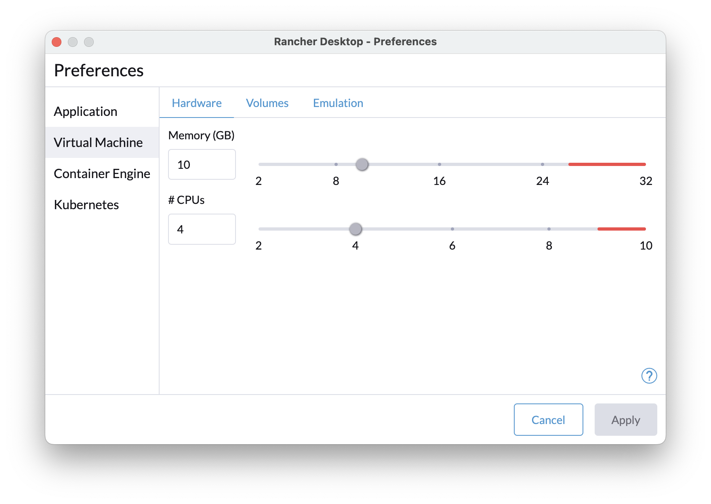

3. Configure Container Engine used by Rancher Desktop (Under Preferences, Container Engine tab) to dockerd(moby)

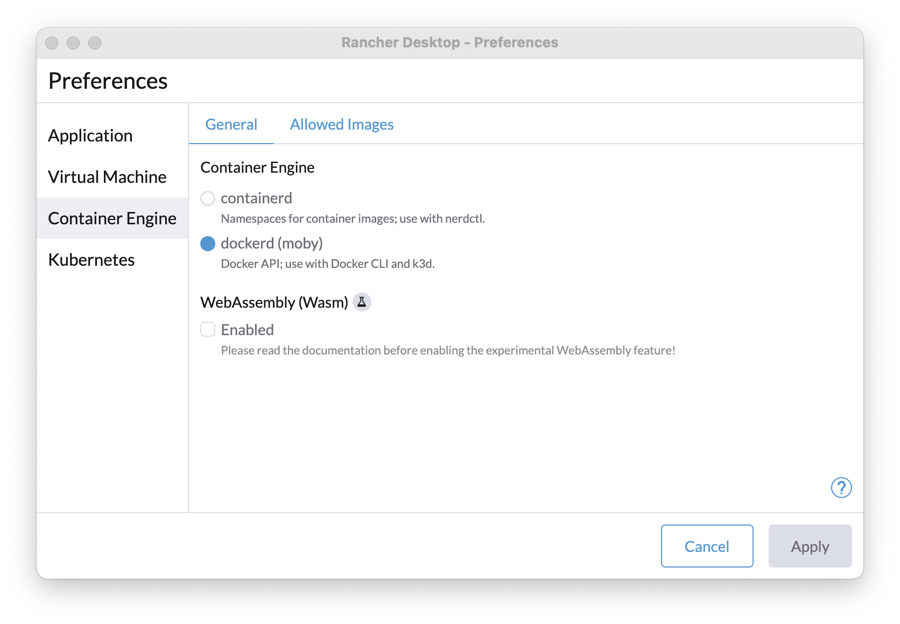

4. Configure Kubernetes Version used by Rancher Desktop (Under Preferences, Kubernetes tab) to v1.28.5

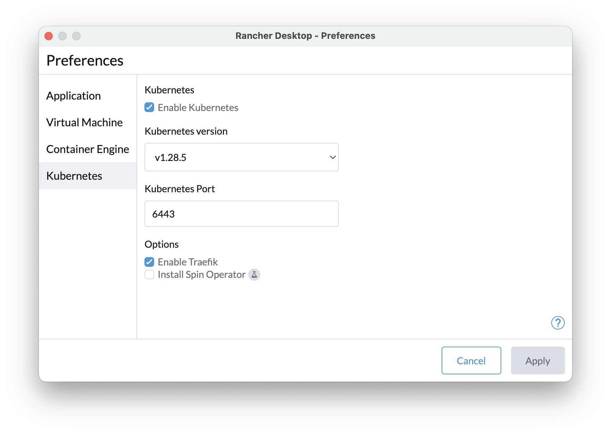

5. Enable resource monitoring by navigating to Extensions and Install Resource usage.

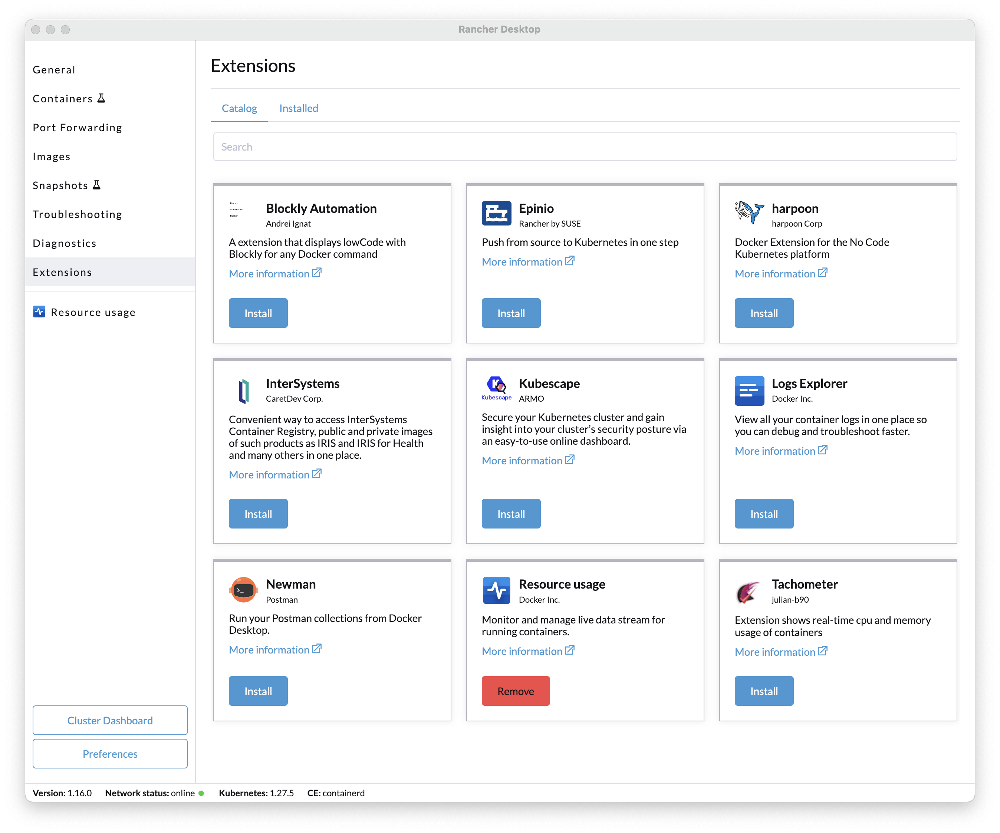

5. Check Resource usage dashboard by navigating to Resource usage


6. After the Kubernetes services (k3s) is up and running, we can open a terminal console to access to the cluster.
   Open your terminal, you should now have access to your local K3S cluster.

```
❯ kubectl get node
NAME                   STATUS   ROLES                  AGE   VERSION
lima-rancher-desktop   Ready    control-plane,master   76d   v1.28.5+k3s1
```


## Task 2 - Deploy GenAI app Open WebUI with Ollama into Rancher Desktop local K3s cluster

Let's deploy GenAI app Open WebUI with ollama into our local k3s cluster.

1. Prepare the `open-webui-values-k3s.yaml` file.

```
ollama:
  image:
    tag: 0.3.9
  resources:
    requests:
      cpu: "2000m"
      memory: "2Gi"
    limits:
      cpu: "4000m"
      memory: "6Gi"
      nvidia.com/gpu: "0"
  service:
    type: ClusterIP
  gpu:
    enabled: false
  models: ["mistral:7b"]
  persistentVolume:
    enabled: true
    size: 20Gi

resources:
  requests:
    cpu: "500m"
    memory: "500Mi"
  limits:
    cpu: "1000m"
    memory: "1Gi"
ingress:
  enabled: true
  host: open-webui.example.com
service:
  type: NodePort
```


2. Add helm repo for Open WebUI.
```
helm repo add open-webui https://helm.openwebui.com/
helm repo update
```


3. Deploy open-webui with embedded llama onto your local k3s
```
kubectl create ns myfirstgenai
helm upgrade --install open-webui-ollama open-webui/open-webui \
  --namespace myfirstgenai \
  --create-namespace \
  --values open-webui-values-k3s.yaml
```

4. Check the deployment status

```
❯ kubectl get all -n myfirstgenai
NAME                                      READY   STATUS    RESTARTS   AGE
pod/open-webui-pipelines-bd86b5bc-nzpvb   1/1     Running   0          7d
pod/open-webui-0                          1/1     Running   0          7d
pod/open-webui-ollama-5d6b97fc9f-kjzqw    1/1     Running   0          7d

NAME                           TYPE        CLUSTER-IP      EXTERNAL-IP   PORT(S)        AGE
service/open-webui             NodePort    10.43.110.192   <none>        80:32574/TCP   7d
service/open-webui-pipelines   ClusterIP   10.43.231.90    <none>        9099/TCP       7d
service/open-webui-ollama      ClusterIP   10.43.152.145   <none>        11434/TCP      7d

NAME                                   READY   UP-TO-DATE   AVAILABLE   AGE
deployment.apps/open-webui-pipelines   1/1     1            1           7d
deployment.apps/open-webui-ollama      1/1     1            1           7d

NAME                                            DESIRED   CURRENT   READY   AGE
replicaset.apps/open-webui-pipelines-bd86b5bc   1         1         1       7d
replicaset.apps/open-webui-ollama-5d6b97fc9f    1         1         1       7d

NAME                          READY   AGE
statefulset.apps/open-webui   1/1     7d
```


5. Enable port-forwarding for open-webui , open-webui-ollama and open-dgr-svc by navigating to Port Forwarding.
   * forward `open-webui` to port `8080`
   * forward `open-webui-ollama` to port `11434`

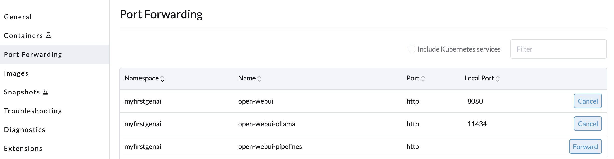


6. Navigate to the `http://localhost:8080` and sign up your own first user account and sign in.

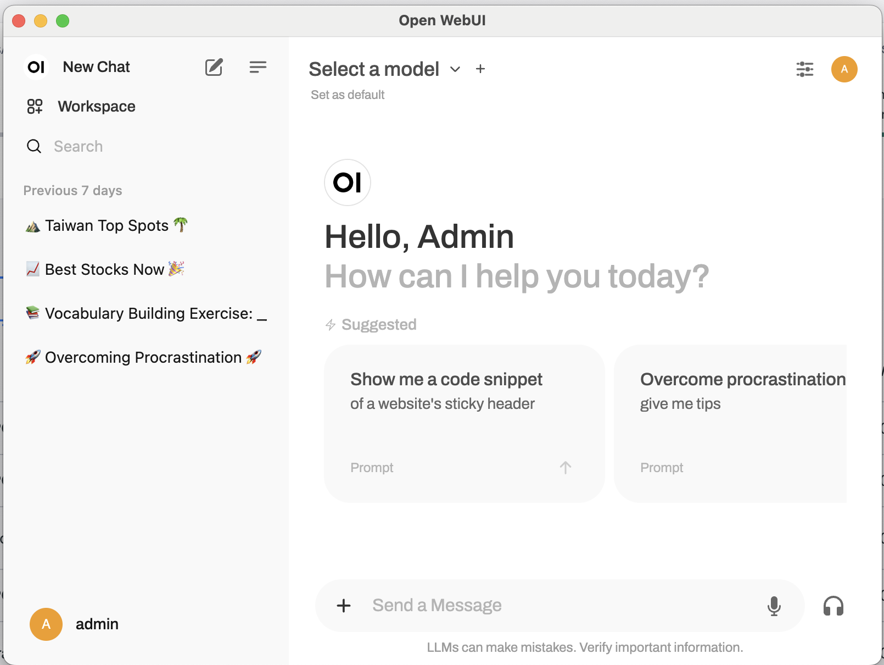


7. Download the `mistral` LLM from Open WebUI.

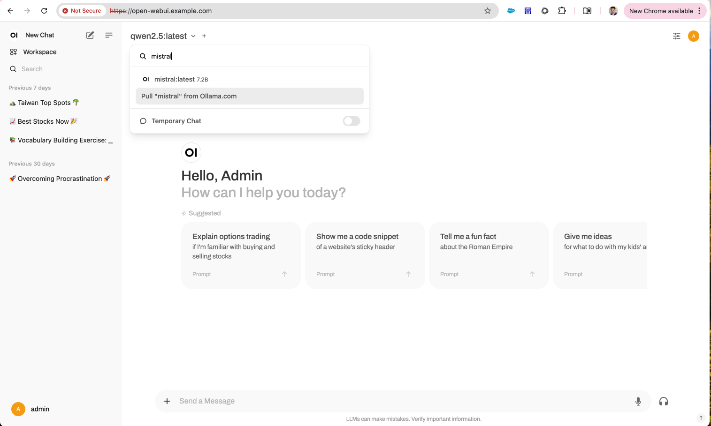


8. Let's try to ask questions to see if the local LLM works.
   For example: `why is the sky blue?  please answer in less than 10 words`

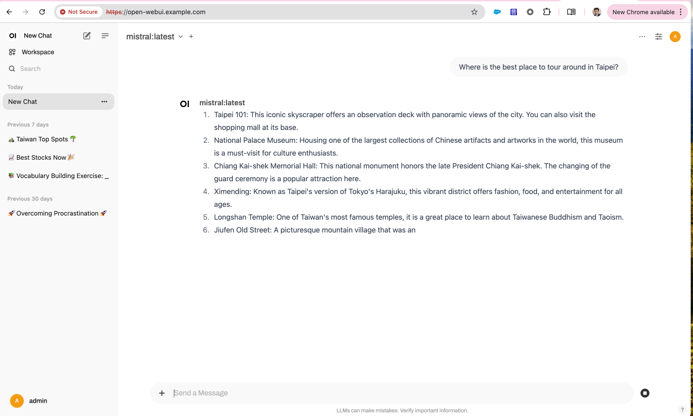

9. Let's try test the ollama api with command curl
```
curl http://localhost:11434/api/chat -d '
{
  "model": "mistral",
  "stream": false,
  "messages": [
    { "role": "user", "content": "why is the sky blue?  please answer in less than 10 words." }
  ]
} '
```

## Task 3 - Deploy the OpenDGR API gateway protec the GenAI app

Let's deploy OpenDGR onto our local k3s cluster.

1.  OpenDGR Deployment with a single line curl command 
```
curl -s https://raw.githubusercontent.com/TPIsoftwareOSPO/digiRunner_Open/refs/heads/master/manifest/open_dgr.yaml | kubectl apply -f -
```

2. Enable port-forwarding for open-webui , open-webui-ollama and open-dgr-svc by navigating to Port Forwarding.
   * forward `open-dgr-svc` to port `18080`

   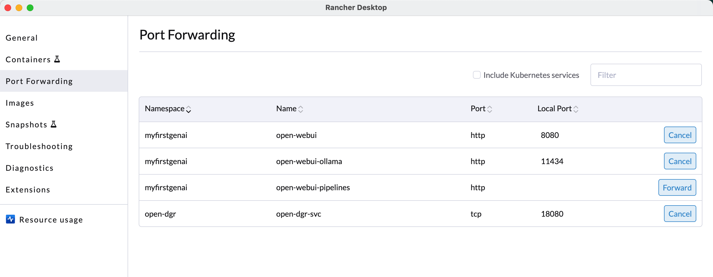

3. Navigate to the `http://localhost:18080/dgrv4/ac4/login` and login with OpenDGR manager.
* 登入帳號: manager
* 密碼: manager123
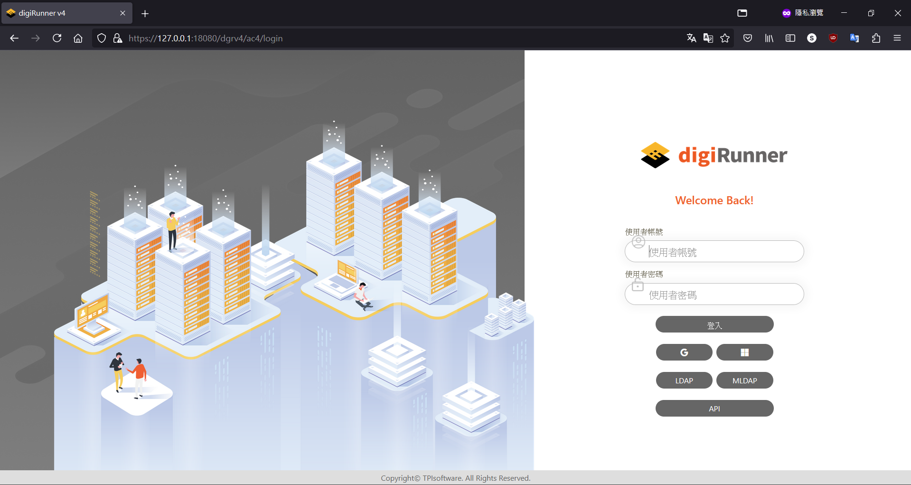 

4.  Navigate to API registry (Under API Management, API Registry).
* Target URL : http://localhost:11434/api/chat
* API Name : chat
* digiRunner Proxy Path : chat
* Http Methods : POST
* No Auth : Yes
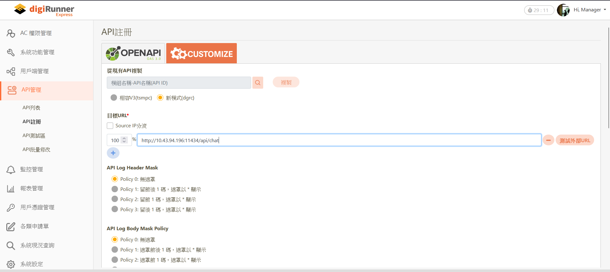  


5.  Navigate to API List, Enable Chat API.
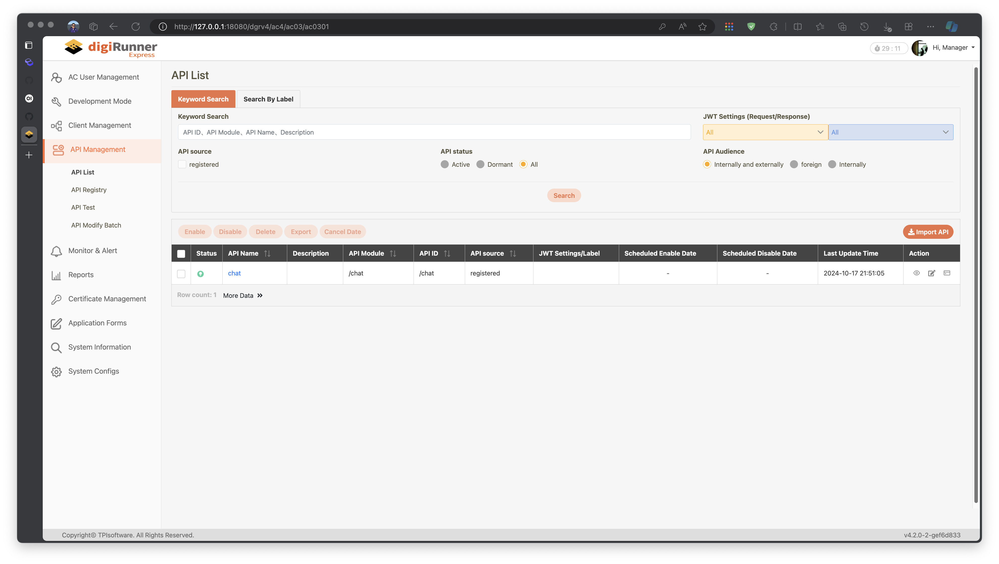  

6.  Navigate to API Test and try test the ollama api

* Target URL : http://localhost:8080/chat
* Http Methods : POST
* http body:
```
{
  "model": "mistral",
  "stream": false,
  "messages": [
    { "role": "user", "content": "why is the sky blue?  please answer in less than 10 words." }
  ]
} 
```
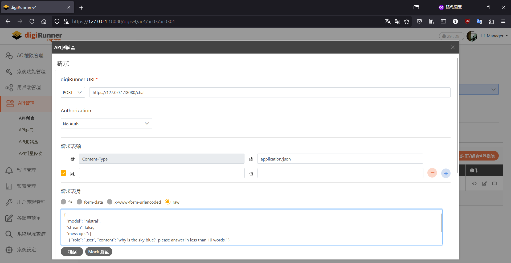

7. API test result with ollama.
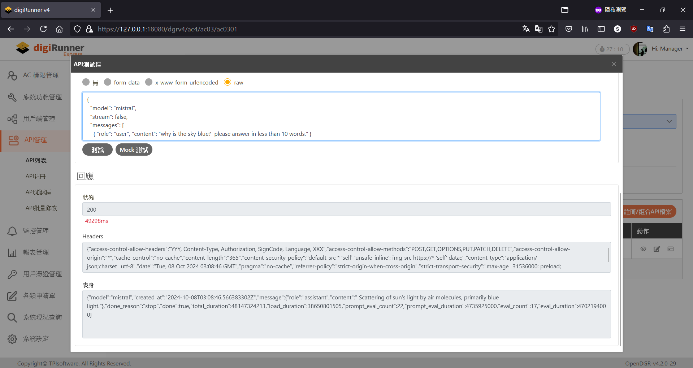  

## Conclusion

We successfully set up a Rancher Desktop with K3s to create a local Kubernetes environment. Next, we deployed the GenAI application, OpenWebUI with Ollama, into the local K3s cluster. Finally, we secured the GenAI app using the OpenDGR API gateway. 

As the next step, we will demo to utilize Rancher Fleet to deploy the GenAI applications into the production environment, ensuring scalability and reliability

By following these steps, users can effectively simulate a production environment, test deployments, and manage large-scale applications.


