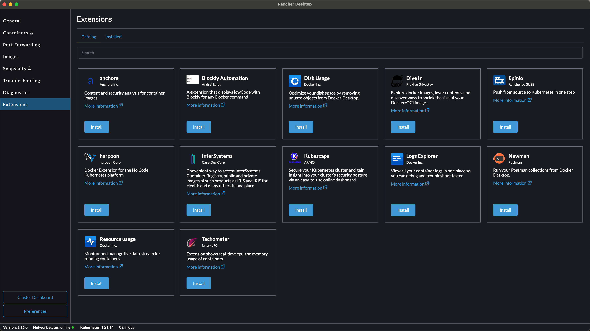
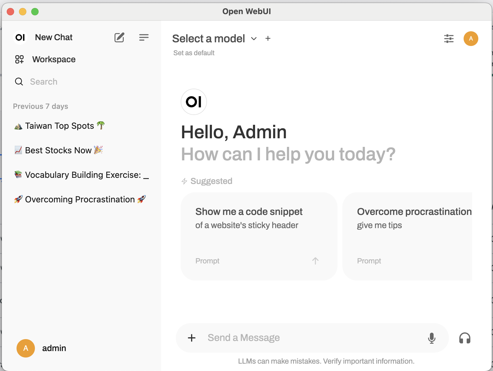
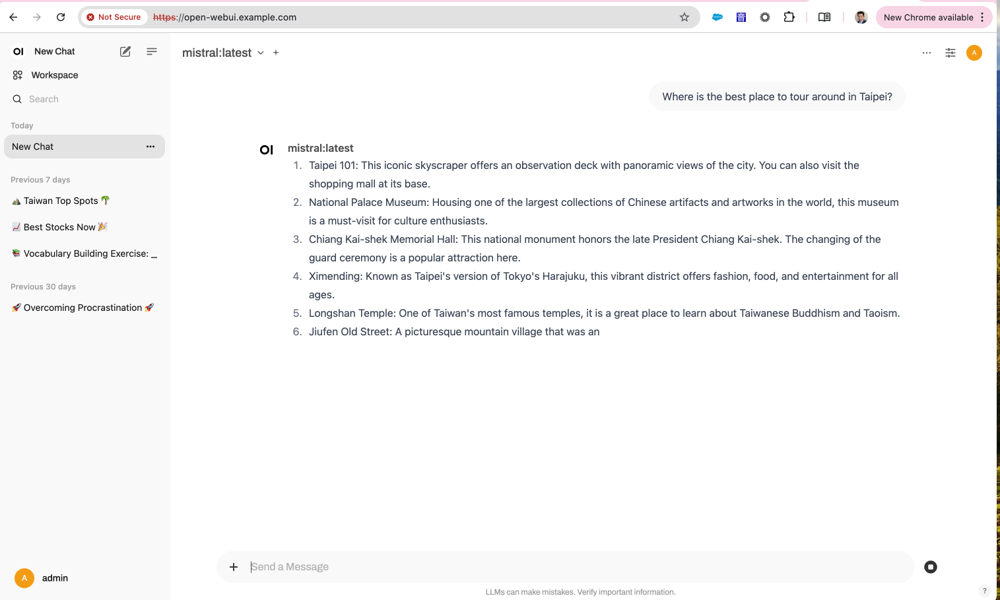

# Develop & Deploy GenAI App with Ollama, Open WebUI with K3S in Rancher Desktop

In this guide, we are going to show you how to ...


Table of Contents:

[TOC]

## System Requirements

To complete this lab, you need to have a laptop (Quad core, 16GB RAM and 50GB free SSD disk space) with fast and stable internet access with one of the following operating systems installed.

* Windows 10, 
* MacBook Apple Silicon M1 or above, or 
* Linux (e.g. OpenSUSE Leap)


## Task 1Setup Rancher Desktop and K3S

Setup the development environment. Intend to develop everything within containers.


Get K3S and [Rancher Desktop](https://rancherdesktop.io/) up and running

1. Download from [Rancher Desktop](https://rancherdesktop.io/) website and install the latest stable version of Rancher Desktop application (v1.16 at the time of this writing) on your laptop.

2. Configure VM used by Rancher Desktop (Under Preferences, Virtual Machine tab) to be 10GB RAM and 4 vcore

   

3. Enable resource monitoring  by navigating to Extensions and Install Resource usage.

   

   

4. After the Kubernetes services (k3s) is up and running, we can open a terminal console to access to the cluster.

5. Open your terminal, you should now have access to your local K3S cluster.

```
❯ kubectl get node
NAME                   STATUS   ROLES                  AGE   VERSION
lima-rancher-desktop   Ready    control-plane,master   41d   v1.21.14+k3s1
```


## Task 2 - Deploy GenAI app with Ollama and OpenWebUI onto Rancher Desktop local K3s cluster

Let's deploy Ollama and Open WebUI onto our local k3s cluster.


1. Prepare the `open-webui-values-k3s.yaml` file.

```
ollama:
  image:
    tag: 0.3.9
  resources:
    requests:
      cpu: "2000m"
      memory: "2Gi"
    limits:
      cpu: "4000m"
      memory: "6Gi"
      nvidia.com/gpu: "0"
  service:
    type: ClusterIP
  gpu:
    enabled: false
  persistentVolume:
    enabled: true
    size: 20Gi

resources:
  requests:
    cpu: "500m"
    memory: "500Mi"
  limits:
    cpu: "1000m"
    memory: "1Gi"
ingress:
  enabled: true
  host: open-webui.example.com
service:
  type: NodePort
```
<!-- 1.  open-webui-values-k3s Deployment with a single line curl command 
```
curl -s https://raw.githubusercontent.com/<to be update later on>open-webui-values-k3s.yaml | kubectl apply -f -
``` -->


2. Add helm repo for Open WebUI.

```
helm repo add open-webui https://helm.openwebui.com/
helm repo update
```


3. Deploy open-webui with embedded llama onto your local k3s

```
kubectl create ns myfirstgenai
helm upgrade --install open-webui-ollama open-webui/open-webui \
  --namespace myfirstgenai \
  --create-namespace \
  --values open-webui-values-k3s.yaml
```
### around 3 minutes 


4. Check the deployment status

```
❯ kubectl get all -n myfirstgenai
NAME                                      READY   STATUS    RESTARTS   AGE
pod/open-webui-pipelines-bd86b5bc-nzpvb   1/1     Running   0          7d
pod/open-webui-0                          1/1     Running   0          7d
pod/open-webui-ollama-5d6b97fc9f-kjzqw    1/1     Running   0          7d

NAME                           TYPE        CLUSTER-IP      EXTERNAL-IP   PORT(S)        AGE
service/open-webui             NodePort    10.43.110.192   <none>        80:32574/TCP   7d
service/open-webui-pipelines   ClusterIP   10.43.231.90    <none>        9099/TCP       7d
service/open-webui-ollama      ClusterIP   10.43.152.145   <none>        11434/TCP      7d

NAME                                   READY   UP-TO-DATE   AVAILABLE   AGE
deployment.apps/open-webui-pipelines   1/1     1            1           7d
deployment.apps/open-webui-ollama      1/1     1            1           7d

NAME                                            DESIRED   CURRENT   READY   AGE
replicaset.apps/open-webui-pipelines-bd86b5bc   1         1         1       7d
replicaset.apps/open-webui-ollama-5d6b97fc9f    1         1         1       7d

NAME                          READY   AGE
statefulset.apps/open-webui   1/1     7d
```


5. Enable port-forwarding for open-webui , open-webui-ollama and open-dgr-svc by navigating to Port Forwarding.
   * forward `open-webui` to port `8080`
   * forward `open-webui-ollama` to port `11434`

   


6. Navigate to the `[open-webui.example.com](http://localhost:8080/)` and sign up your own first user account and sign in.




7. Download the `mistral` LLM from Open WebUI.


8. Let's try to ask questions to see if the local LLM works.

why is the sky blue?  please answer in less than 10 words



## Task 3 - Deploy the OpenDGR API gateway protec the GenAI app

Let's deploy OpenDGR onto our local k3s cluster.

1.  OpenDGR Deployment with a single line curl command 
```
curl -s https://raw.githubusercontent.com/TPIsoftwareOSPO/digiRunner_Open/refs/heads/master/manifest/open_dgr.yaml | kubectl apply -f -
```

 


2. Enable port-forwarding for open-webui , open-webui-ollama and open-dgr-svc by navigating to Port Forwarding.
   * forward `open-dgr-svc` to port `18080`

   

3. Navigate to the `http://127.0.0.1:18080/dgrv4/ac4/login` and login with manager.
   * Open DGR - default manager 帳號、密碼
   * username: manager
   * password: manager123
   *  

4.  Navigate to API registration.
    

5.  Navigate to API registration.
    

6.  test curl the ollama api with command
```
curl http://127.0.0.1:11434/api/chat -d '
{
  "model": "mistral",
  "stream": false,
  "messages": [
    { "role": "user", "content": "why is the sky blue?  please answer in less than 10 words." }
  ]
} '
```

7.  Navigate to API registration.
  

8.  Navigate to API registration.
  


## Deploy the GenAI app to Rancher-managed environment with Rancher Fleet (Demo) 

Rancher Fleet is a Continuous Delivery (GitOps) tool to manage deployments from a single Kubernetes cluster to large-scale deployment of Multiple Kubernetes clusters.

Rancher Fleet can manage deployments from git of raw Kubernetes YAML, Helm charts, or Kustomize or any combination of the three. Regardless of the source all resources are dynamically turned into Helm charts and Helm is used as the engine to deploy everything in the cluster. This gives a high degree of control, consistency, and auditability.


1. Go back to Rancher Server home page, Click the top left `☰` 3-line bar icon to expand the navigation menu, click `Continuous Delivery`


Before we proced, let's verify if we can see all our clusters in Continous Delivery


With Rancher Fleet, one can manage individual or group of clusters. Managing cluster via Group reduces adminstrative efforts. 


1. Now we will create a Cluster Group.

Navigate to `Cluster Group` and click on `Create`. 


Give it a name `development`

Under Cluster Selector , click **Add Rule** provide the following values

Key:`env`

Operator: `in list`

Value:`dev` 

we are going to use the same Label which was used to create `azure-rke2-cluster` and `aliyun-rke2-cluster`.


 
Once you key in the key:value pair, Rancher will use the selector labels to indentify the clusters to be associated with our newly created cluster group in Rancher Continuous Delivery. You should see it show matches all 2 existing clusters. 

Click on `Create` which will create our first Cluster Group.


we can click into the `development` cluster group for resources details.


3. Configure a git repository

we will use the fleet-examples git repo to deploy the Kubernetes sample guestbook application. The app will be deployed into the default namespace.

you can also fork the fleet-examples Git Repository(https://github.com/rancher/fleet-examples) for testing.

In the `Git Repos` page click on `Add Repository`


- Enter `fleet-examples` as your git repo `Name`
- Enter `https://github.com/rancher/fleet-examples` (the fleet-examples git repo URL) in `Repository URL`  

- scroll to the bottom and enter Paths: `simple` , with all the parameters default setting then click **Next**

Sample output of the GitRepo configuration below


in the Step2, Deploy to `Target` dropdown list, select the Cluster Group we created previosuly `development`. 


We have successfully completed Rancher Contious Delivery (GitOps) configuration. 


click into the `fleet-examples` git repo, you can expect the example app will be deployed to the cluster group in a minute.


When there is any commit or updates in the git repo, fleet by default will checks the git repo changes every 15 seconds, then fleet will deploy new changes into the cluster group automatically.


